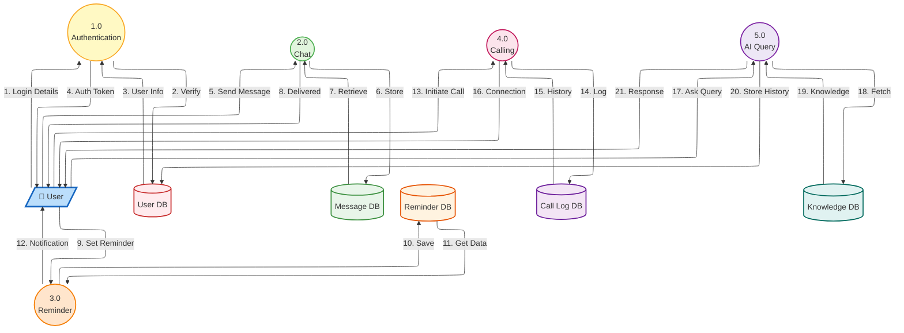

# System Architecture Diagram

This diagram shows the user interaction flow with different system components.

## System Components:
- **Authentication**: User login and verification
- **Chat**: Messaging functionality
- **Reminder**: Notification system
- **Calling**: Voice/video calls
- **AI Query**: AI-powered assistance
